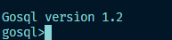
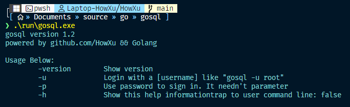

# gosql



使用**Go**语言实现的简单数据库应用,包含以下特点:

1. 基于B+树的命令语法解析  
2. 基于Go内置的数据库类型支持  
3. 基于Go文件IO的数据库基础功能  
4. 外置命令与内置Shell实现  
5. 简单的多进程多用户的数据库锁  
6. 完整的Log体系  
7. 基于Go内置多线程的性能优化  
8. AES加密  

# Usage

## 原生命令行
gosql使用原生命令行式登陆:



你可以使用如下命令登陆(请注意,第一次登陆只能使用root账户):

```shell
gosql -u [username] -p
```

更多用法参考`-h`输出

## SQL语法

gosql支持基本的原生sql语法(create,drop,show,select,insert,update,delete及where条件语句和and or判定),同时支持首字母大写,全大写,全小写三种语法格式.

> [!CAUTION]\
> gosql的where查询比较原始,只支持单个and/or查询,如  
> "name=kali and age=10 and dog=true"是合法的  
> "name=kali and age=10 **or** dog=true"是**非法**的.  

gosql支持string,int,float,boolean四种数据格式(还有一种string[],但是已经被废弃)

gosql支持引号用法,及`"name"="J.K Linux" and age="10" and "is_man"=false`是合法的

### 数据库语法:

```sql
#创建数据库
create database [name]
#使用数据库
use database [name]
#删除数据库
drop database [name]
```

### 表语法:

```sql
#创建表
create table [name] [column1]=[data_type1],[column2]=[data_type2]...
#删除表
drop database [name]
```

### Select语法

```sql
select [column1],[column2]... from [table1],[table2]... \
(where [column1]=[data1] and/or [column2]=[data2] and/or ...)
```

e.g:

```sql
select age from student where age=10 and is_man=true
```

### Update语法

```sql
update [table1],[table2]... set [column1]=[data1],[column2]=[data2]... \
(where [column1]=[data1] and/or [column2]=[data2] and/or ...)
```

e.g:

```sql
update student set is_man=false where age=10 and name="old_e"
```

### Insert语法

> [!CAUTION]\
> gosql不支持为字段创建默认值,所以你需要添加所有字段所有值  

```sql
insert into [table1],[table2]... values [data1],[data2]...
```

e.g:

```sql
insert into student values "howxu",66,true
```

### Delete语法

```sql
delete from [table1],[table2]... \
(where [column1]=[data1] and/or [column2]=[data2] and/or ...)
```

e.g:

```sql
delete from student where name="howxu" or "age"="14"
```

### 其它语法

```shell
#修改本用户密码
passwd
#打印用户名
whoami
#退出
exit
```

# 开发

欢迎Issue和PR

> [!NOTE]\
> Go 1.23.3  
> Windows 11 24H2  
> Mingw make 4.4.1

## 构建

```shell
make build
```

你可以在`build`文件夹下找到`gosql.exe`文件

## 测试

```shell
make ARGS="-u [username] -p"
```

具体内容参考[本项目Makefile](./Makefile)

# 展望未来

基于Go的网络接口服务  
可以通过Java与Spring进行对接的库(下次也不一定)

